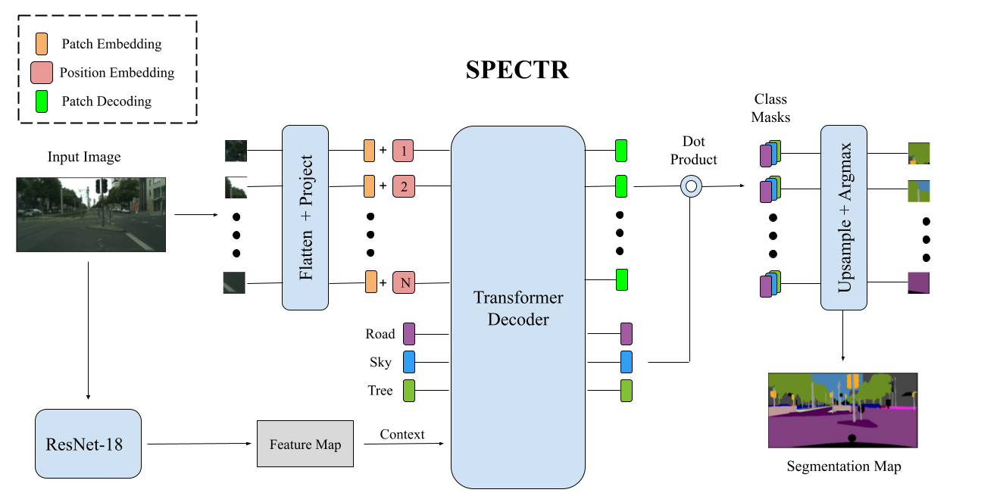

# SPECTR: Segmentation using Positional Encoding, CNNs, and Transformers
<br/>
SPECTR by Anshul Ahluwalia, Aditya Singh, and Ranveer Thind  
  


## Installation
To install SPECTR, we first much create a conda environment with the appropriate libraries.
```
conda env create -f environment.yml
conda activate spectr-v1
```

Next, install `spectr` as a module:
````
pip install -e .
````

## Training Instructions
1. Download the [Cityscapes Dataset](https://www.cityscapes-dataset.com/) onto your local machine and unzip the files:
`leftImg8bit_trainvaltest.zip` and `gtFine_trainvaltest.zip`.
2. To preprocess the image data and labels, run `python spectr/src/cityscapes_preprocess.py`. Before running this 
script, make sure to modify the file paths to be correct for your machine.
3. Modify the hyperparameters defined in `spectr/config/config.yaml`.
4. Finally, run `python spectr/src/lightning_train.py` to train the model using the Pytorch Lightning Framework. As
training proceeds, a recent copy of your model will be saved in the `lightning_logs/checkpoints` directory.

## Testing Instructions
1. To evaluate the SPECTR model checkpoint on a random training or testing batch, run 
`python spectr/src/lightning_test.py`.
    - This will calculate mIoU for the model on the specific batch and dump all visualizations inside the `viz` folder.
    - You must specify the absolute file path to the pytorch checkpoint model.